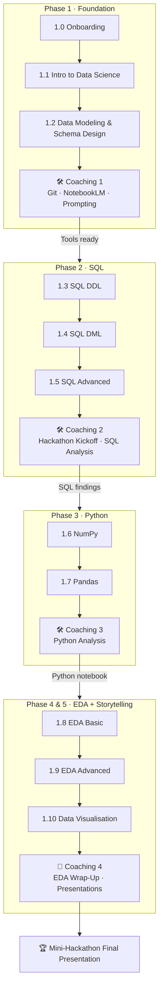

# **🗺️ Course Roadmap — Data Science & AI Module 1**

## **Your Journey from Zero to Data Analyst**

**The Final Destination:**

*By the end of Module 1, you will work in a group to investigate a real dataset, uncover business insights, and present your findings — using every skill built across the 10 lessons.*

---

## **📌 How the Module is Structured**

The module runs across **10 lessons** grouped into 5 phases, with **4 coaching sessions** woven between them. Coaching sessions are not extra classes — they are where you apply what you just learned to a real dataset, so the hackathon project builds progressively each week.

```
Lessons 1.0–1.2  →  Coaching 1 (Tools)
Lessons 1.3–1.5  →  Coaching 2 (Hackathon Kickoff + SQL)
Lessons 1.6–1.7  →  Coaching 3 (Python Analysis)
Lessons 1.8–1.10 →  Coaching 4 (EDA + Final Presentation)
```

---

## **🟢 Phase 1: The Foundation**

*Before touching data, build the mental model for what data science is and how data is structured.*

| Lesson | Title | What You Learn | 🏆 Hackathon Contribution |
|:---|:---|:---|:---|
| **1.0** | **Welcome & Onboarding** | Set up your tools, join Discord, meet the cohort | Orient yourself — understand the module structure and what the hackathon asks of you |
| **1.1** | **Intro to Data Science** | The Analytics → Data Science → AI hierarchy; data pipelines; data ethics & bias | Frame the kinds of questions a dataset can answer and identify the right analytical approach |
| **1.2** | **Data Modeling & Schema Design** | Relational vs. NoSQL vs. Vector databases; ERDs; Primary & Foreign Keys; Normalization (1NF–3NF) | Read and interpret a dataset's schema — understand how tables connect before writing a single query |

> ### 🛠️ Coaching Session 1 — Tools & AI Companion
>
> **Focus:** Get your professional toolkit ready before the real analytical work begins.
>
> | Activity | What You Do |
> |:---|:---|
> | **Git & GitHub** | Learn version control basics — create a repo, commit your work, push to GitHub. Every hackathon deliverable will be version-controlled from here. |
> | **Google NotebookLM** | Set up your AI study companion. Learn to upload course materials and use NotebookLM to summarise, quiz yourself, and generate study notes. |
> | **Effective Prompting** | Learn how to write clear, specific prompts to get useful answers from AI tools — for debugging code, explaining concepts, and brainstorming analysis angles. |
>
> *No hackathon deliverable this session — focus entirely on getting comfortable with the tools you'll use for the rest of the module.*

---

## **🔵 Phase 2: SQL — Querying the Warehouse**

*You cannot analyse a large dataset in Excel. SQL lets you ask precise questions of millions of rows in seconds.*

| Lesson | Title | What You Learn | 🏆 Hackathon Contribution |
|:---|:---|:---|:---|
| **1.3** | **SQL Basic — DDL** | CREATE TABLE, data types, constraints (PK/FK/NOT NULL/CHECK), COPY, indexes, views | Create the database tables and load the hackathon dataset |
| **1.4** | **SQL Basic — DML** | SELECT, WHERE, ORDER BY, aggregates (COUNT/SUM/AVG), GROUP BY, HAVING, CASE, CAST | Write exploratory queries — "Which category has the highest average value? What is the distribution by region?" |
| **1.5** | **SQL Advanced** | JOINs (Inner/Left/Right/Full), UNION, window functions (running totals, RANK), CTEs | Combine tables, rank records, and build the complex queries your analysis needs |

> ### 🛠️ Coaching Session 2 — Hackathon Kickoff & SQL Analysis
>
> **Focus:** Form your group, agree on your business questions, and run your first real analysis.
>
> | Activity | What You Do |
> |:---|:---|
> | **Form Groups** | Teams of 3–4 learners. Choose a dataset domain together (e.g. retail, healthcare, transport, finance). |
> | **Hackathon Kickoff** | Each group defines 3–5 business questions they want to answer with the dataset. Questions are reviewed with the coach before analysis begins. |
> | **SQL Analysis Sprint** | Use SELECT, GROUP BY, JOINs, and at least one window function to start answering your questions. |
>
> **Session Deliverable:** A `.sql` file with your group's exploratory queries and a brief written summary of what you found.
> *Share in #peer-reviews on Discord.*

---

## **🟠 Phase 3: Python — The Analytical Engine**

*SQL retrieves the data. Python transforms, calculates, and models it at scale.*

| Lesson | Title | What You Learn | 🏆 Hackathon Contribution |
|:---|:---|:---|:---|
| **1.6** | **Intro to NumPy** | ndarray creation, broadcasting, indexing & slicing, vectorised operations, basic linear algebra | Perform fast numerical calculations on dataset columns without writing loops |
| **1.7** | **Intro to Pandas** | DataFrames & Series, `.loc`/`.iloc`, Boolean filtering, `.apply()`, sort & rank | Load the dataset into Python, filter it, and begin exploring it programmatically |

> ### 🛠️ Coaching Session 3 — Python Analysis
>
> **Focus:** Move your SQL findings into Python and deepen the analysis with NumPy and Pandas.
>
> | Activity | What You Do |
> |:---|:---|
> | **Load & Inspect** | Load your dataset into a Pandas DataFrame. Run `.info()`, `.describe()`, `.value_counts()` on the key columns. |
> | **Filter & Slice** | Reproduce your SQL findings using Pandas Boolean filters and `.groupby()`. |
> | **NumPy Calculations** | Use NumPy for any statistical or numerical calculations (e.g. normalising values, calculating percentage changes). |
>
> **Session Deliverable:** A Jupyter notebook with your group's Python exploration — structured sections, readable code, and brief written interpretations of each output.
> *Share your notebook link in #peer-reviews on Discord.*

---

## **🟣 Phase 4: EDA — Finding the Insights**

*Real data is messy. This phase turns raw data into trustworthy, analysis-ready insights.*

| Lesson | Title | What You Learn | 🏆 Hackathon Contribution |
|:---|:---|:---|:---|
| **1.8** | **EDA Basic** | Descriptive statistics, missing values & duplicates, outlier detection, type conversion, string cleaning, file I/O | Clean your dataset — fix types, remove nulls and duplicates — so every downstream result can be trusted |
| **1.9** | **EDA Advanced** | Datetime parsing & resampling, SQL-style merges, wide ↔ long reshaping (melt/pivot), GroupBy & pivot tables | Aggregate by time period, merge supporting tables, and generate the summary statistics your presentation will be built on |

---

## **🔴 Phase 5: Visualisation & Storytelling**

*Analysis is only as valuable as its communication. Turn numbers into decisions.*

| Lesson | Title | What You Learn | 🏆 Hackathon Contribution |
|:---|:---|:---|:---|
| **1.10** | **Data Visualisation & Storytelling** | The 3 pillars (Perception, Design, Storytelling); chart selection; Matplotlib (Figure/Axes/Plot); Seaborn statistical graphics; audience-first communication | Build the charts that support your narrative and frame them in a clear three-act story |

> ### 🏁 Coaching Session 4 — EDA Wrap-Up & Final Presentations
>
> **Focus:** Complete your analysis and present your findings to the cohort.
>
> | Activity | What You Do |
> |:---|:---|
> | **EDA Wrap-Up** | Use the first part of the session to finalise your cleaning, pivot tables, and visualisations. Coaches circulate to help groups that are stuck. |
> | **Group Presentations** | Each group presents for **10 minutes including Q&A** — roughly 7 minutes to present, 3 minutes for questions from the cohort and coaches. |
>
> **Presentation must include:**
> - The business questions your group chose to investigate
> - A summary of the dataset and any data quality issues you found
> - At least 3 visualisations with clear titles and axis labels
> - 3 or more data-backed insights stated in plain language
> - One recommendation a non-technical decision-maker could act on
>
> *Upload your final notebook and any slides to #peer-reviews on Discord before the session starts.*

---

## **🏆 Mini-Hackathon — How It Works**

The Mini-Hackathon is **not a single event** — it is a progressive project that builds across all 4 coaching sessions.

| Coaching Session | When | What Your Group Does |
|:---|:---|:---|
| **Coaching 1** | After Lessons 1.0–1.2 | Get tools ready (Git, NotebookLM, prompting). No hackathon deliverable — prep only. |
| **Coaching 2** | After Lessons 1.3–1.5 | Form your group, agree on business questions, run SQL exploratory analysis |
| **Coaching 3** | After Lessons 1.6–1.7 | Load data into Python, filter and explore with NumPy & Pandas |
| **Coaching 4** | After Lessons 1.8–1.10 | Finalise EDA and visualisations, then present findings in 10 minutes |

**By the time you present, your notebook is already 80% built** — each coaching session adds a layer, so there is no last-minute scramble.

**Presentations are evaluated on:**
- **Relevance** — Do your business questions matter? Would a real decision-maker care?
- **Rigour** — Is the data clean? Can the numbers be trusted?
- **Clarity** — Would a non-technical audience understand your insights without reading the code?
- **Storytelling** — Do the visualisations support a clear narrative with a beginning, middle, and recommendation?

---

## **🧩 Lesson & Coaching Session Map**


