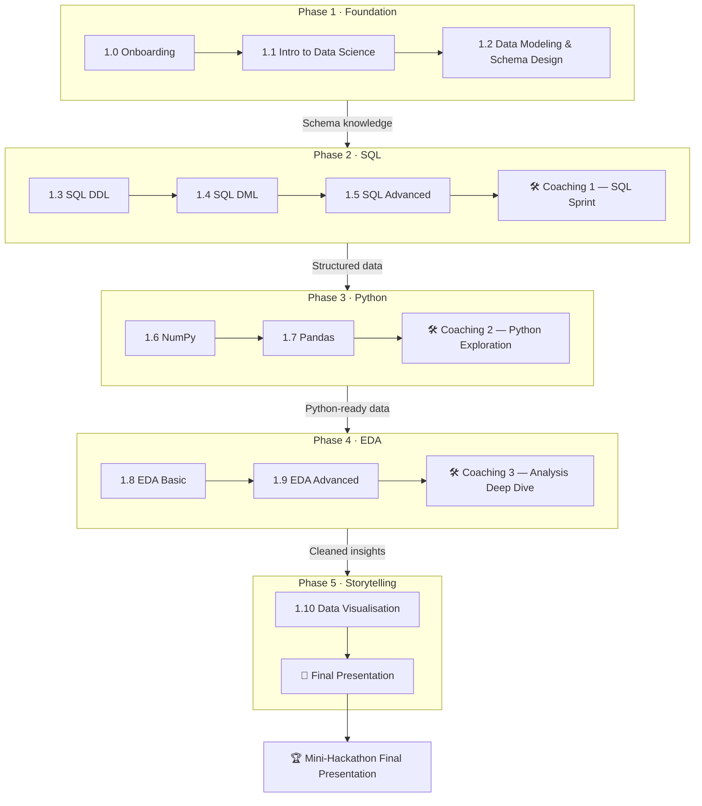

# **🗺️ Course Roadmap — Data Science & AI Module 1**

## **Your Journey from Zero to Data Analyst**

**The Final Destination:**

*By the end of Module 1, you will work in a group to investigate a real dataset, uncover business insights, and present your findings — using every skill built across the 10 lessons.*

---

## **📌 How the Module is Structured**

The module runs across **10 lessons** grouped into 5 phases. Between phases, **coaching sessions** give your group time to apply what you have learned to the Mini-Hackathon dataset. Each coaching session builds directly on the lessons you just completed — so the hackathon grows week by week rather than landing all at once.

```
Lessons  →  Coaching Session  →  More Lessons  →  Coaching Session  →  …  →  Final Presentation
```

---

## **🟢 Phase 1: The Foundation**

*Before touching data, build the mental model for what data science is and how data is structured.*

| Lesson | Title | What You Learn | 🏆 Hackathon Contribution |
|:---|:---|:---|:---|
| **1.0** | **Welcome & Onboarding** | Set up your tools, join Discord, meet your group | Form your hackathon team and choose a dataset domain |
| **1.1** | **Intro to Data Science** | The Analytics → Data Science → AI hierarchy; data pipelines; data ethics & bias | Understand *what questions* your dataset can answer and map it to the right tier of the hierarchy |
| **1.2** | **Data Modeling & Schema Design** | Relational vs. NoSQL vs. Vector databases; ERDs; Primary & Foreign Keys; Normalization (1NF–3NF) | Read and interpret your dataset's schema — understand how tables connect before writing a single query |

---

## **🔵 Phase 2: SQL — Querying the Warehouse**

*You cannot analyse a large dataset in Excel. SQL lets you ask precise questions of millions of rows in seconds.*

| Lesson | Title | What You Learn | 🏆 Hackathon Contribution |
|:---|:---|:---|:---|
| **1.3** | **SQL Basic — DDL** | CREATE TABLE, data types, constraints (PK/FK/NOT NULL/CHECK), COPY, indexes, views | Set up your group's local database and load the hackathon dataset |
| **1.4** | **SQL Basic — DML** | SELECT, WHERE, ORDER BY, aggregates (COUNT/SUM/AVG), GROUP BY, HAVING, CASE, CAST | Write your first exploratory queries — "Which category has the highest average value? What's the distribution by region?" |
| **1.5** | **SQL Advanced** | JOINs (Inner/Left/Right/Full), UNION, window functions (running totals, RANK), CTEs | Combine multiple tables, rank records, and build the complex queries your analysis needs |

> ### 🛠️ Coaching Session 1 — SQL Sprint
> **Milestone:** Each group submits a SQL report answering 3–5 business questions about their dataset.
> Questions are agreed with the coach at the start of the session. You'll use SELECT, GROUP BY, JOINs, and at least one window function.
> *Share your `.sql` file and results screenshot in #peer-reviews on Discord.*

---

## **🟠 Phase 3: Python — The Analytical Engine**

*SQL retrieves the data. Python transforms, calculates, and models it.*

| Lesson | Title | What You Learn | 🏆 Hackathon Contribution |
|:---|:---|:---|:---|
| **1.6** | **Intro to NumPy** | ndarray creation, broadcasting, indexing & slicing, vectorised operations, basic linear algebra | Perform fast numerical calculations on your dataset columns without writing loops |
| **1.7** | **Intro to Pandas** | DataFrames & Series, `.loc`/`.iloc`, Boolean filtering, `.apply()`, sort & rank | Load your dataset into Python and begin selecting, filtering, and exploring it programmatically |

> ### 🛠️ Coaching Session 2 — Python Exploration
> **Milestone:** Each group loads their dataset into a Pandas DataFrame and produces a structured exploration notebook.
> Required: `.info()`, `.describe()`, `.value_counts()` on at least 5 columns; 3 filtered subsets relevant to your business questions.
> *Share your notebook link in #peer-reviews on Discord.*

---

## **🟣 Phase 4: EDA — Finding the Insights**

*Real data is messy. This phase turns raw data into trustworthy, analysis-ready insights.*

| Lesson | Title | What You Learn | 🏆 Hackathon Contribution |
|:---|:---|:---|:---|
| **1.8** | **EDA Basic** | Descriptive statistics, handling missing values & duplicates, outlier detection, type conversion, string cleaning, file I/O | Clean your dataset — remove nulls, fix types, handle duplicates — so every downstream result can be trusted |
| **1.9** | **EDA Advanced** | Datetime parsing & time-series resampling, SQL-style merges, wide ↔ long reshaping (melt/pivot), GroupBy & pivot tables | Aggregate by time period, merge supporting tables, and generate the summary statistics your presentation will be built on |

> ### 🛠️ Coaching Session 3 — Analysis Deep Dive
> **Milestone:** Each group produces a cleaned dataset and an analysis notebook with at least 5 findings.
> Required: one time-series or GroupBy analysis; one pivot table or cross-tabulation; written interpretation of each finding (not just numbers).
> *Share your cleaned dataset + notebook in #peer-reviews on Discord.*

---

## **🔴 Phase 5: Visualisation & Storytelling**

*Analysis is only as valuable as its communication. Turn numbers into decisions.*

| Lesson | Title | What You Learn | 🏆 Hackathon Contribution |
|:---|:---|:---|:---|
| **1.10** | **Data Visualisation & Storytelling** | The 3 pillars (Perception, Design, Storytelling); chart selection; Matplotlib (Figure/Axes/Plot); Seaborn statistical graphics; audience-first communication | Build the charts that support your narrative — bar charts, line charts, scatter plots, distribution plots — and frame them within a three-act story |

> ### 🏁 Final Coaching Session — Hackathon Presentations
> **Milestone:** Each group delivers a 10-minute presentation to the cohort.
> Required: a clear business question, cleaned dataset, at least 3 visualisations, 3+ data-backed insights, and a recommendation.
> Judges / coaches will ask follow-up questions on your methodology and findings.
> *Upload your final notebook and slide deck to #peer-reviews on Discord before the session.*

---

## **🏆 Mini-Hackathon — How It Works**

The Mini-Hackathon is **not a single event** — it is a progressive project woven through the entire module.

| When | What Your Group Does |
|:---|:---|
| Lesson 1.0 | Form your team (3–4 learners), pick a dataset domain (e.g. retail, healthcare, transport, finance) |
| Coaching 1 | Apply SQL skills to explore and extract data |
| Coaching 2 | Load and explore the dataset in Python with Pandas |
| Coaching 3 | Clean, merge, and aggregate — build your analytical story |
| Final Session | Present findings, visualisations, and a data-backed recommendation |

**Each coaching session has a concrete deliverable** — so there is no last-minute scramble. By the time you reach the final presentation, your notebook is already 80% done.

**Evaluation focuses on:**
- Quality of your business questions (are they meaningful?)
- Rigour of your cleaning (can we trust the numbers?)
- Clarity of your insights (would a non-technical manager understand?)
- Visualisation choices (do the charts support the story?)

---

## **🧩 Lesson Dependency Map**


